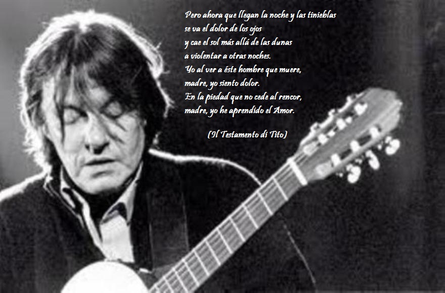

Escuchar y leer a Fabrizio es entrar en un mundo de Humanidad donde los &quot;invisibles&quot;, &quot;desheredados&quot; tienen un sitio normalmente, sino despreciado, sí olvidado.
{: .fs-6 .fw-300 }

[Discografía](/gridtest.html){: .btn .fs-5 .mb-4 .mb-md-0  } [Biografía](/biografia.html){: .btn .fs-5 .mb-4 .mb-md-0 }

---

> "[Sidun](http://animesalve.com/Discografia/Estudio/Creuzadema/Sidun.htm)" si rifà all'invasione di Sharon che aveva portato l'inferno anche in Sidone. “Ho immaginato”, dice De André, “un padre palestinese, sporco, disperato, che tiene in braccio il suo bambino, macinato dai cingoli di un carro armato”. La voce di Fabrizio ha lo stupore della tragedia: invoca, accusa, esita, rantola: un'impotenza sospesa sull'afflizione del mondo. E la melodia ascende, s'attorce, implora silenzio e poi s'apre al grido. Né il testo dà tregua allo sgomento e alla rabbia: racconta le ombre torve dei soldati israeliani.

> "[Sidun](http://animesalve.com/Discografia/Estudio/Creuzadema/Sidun.htm)" se refiere a la invasión de Sharon que también trajo el infierno en Sidón. "Me imaginé ", dice De André, "un padre palestino, sucio, desesperado, que sostiene a su hijo, aplastado por las orugas de un tanque ". La voz de Fabrizio tiene el asombro de la tragedia: invoca, acusa, duda, habla: una impotencia suspendida sobre la aflicción del mundo. Y la melodía se eleva, se retuerce, implora silencio y luego se abre al grito. Tampoco el texto da alivio a la consternación y la ira: revela las sombrías sombras de los soldados israelíes

Smisurate Preghiere – Sulla cattiva strada con Fabrizio De André – Cesare G. Romana ([Sobre canciones](http://animesalve.com/Citas/CancionesCreuzaMa.htm))

